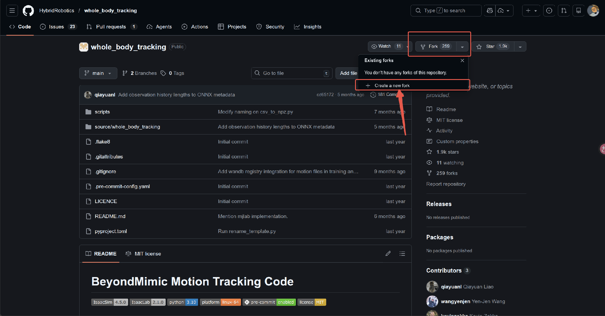
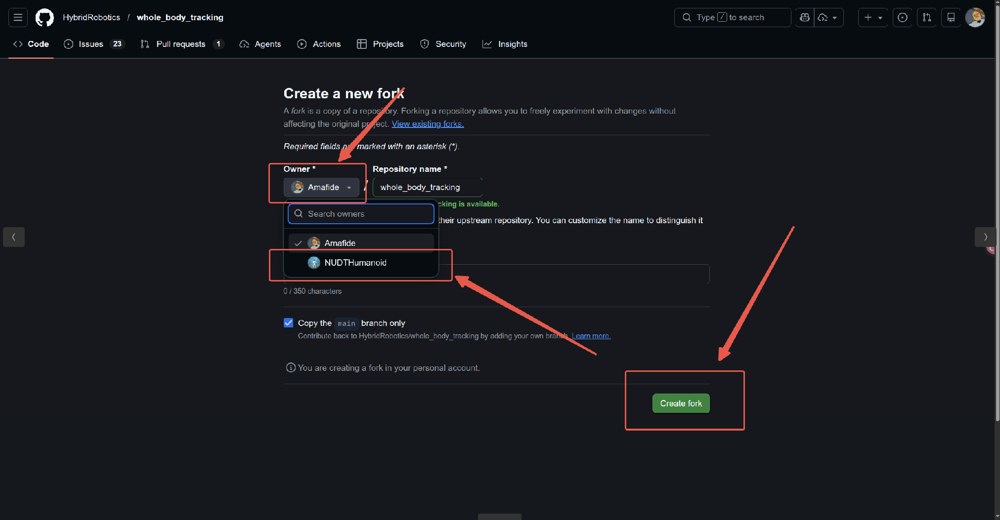
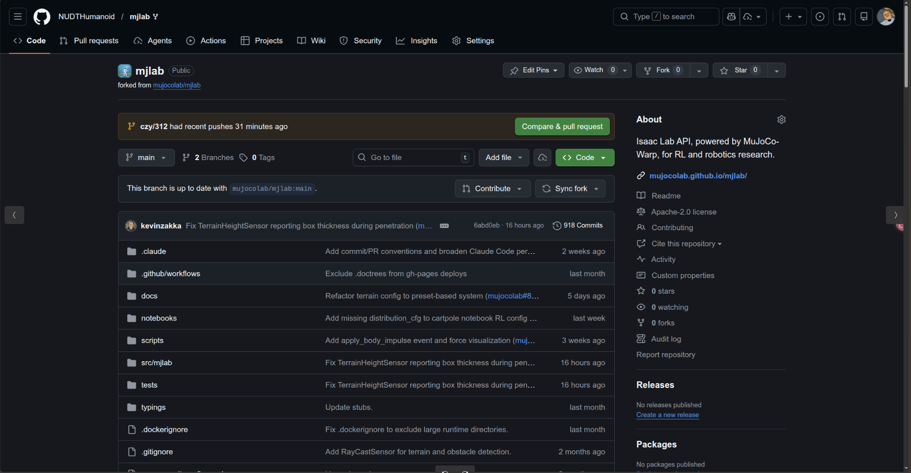
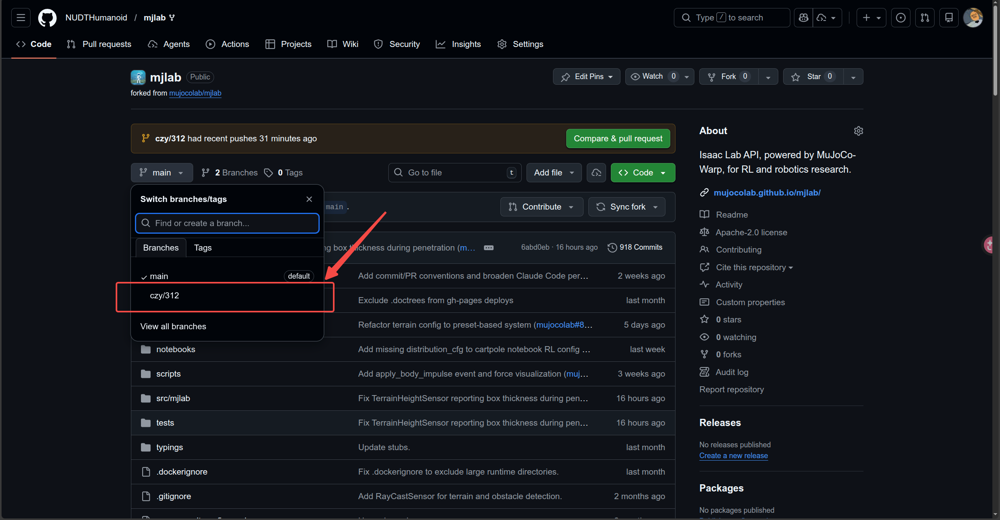

# Main

#### 资料栏

wolai：https://www.wolai.com/9QZVnvSgJRw4u7EsfHqsEZ  
Awesome humanoid robot learning：https://github.com/YanjieZe/awesome-humanoid-robot-learning.git  
git使用指南：https://www.bilibili.com/video/BV1Fw4m1C7Tq/?spm_id_from=333.1387.upload.video_card.click：  
Awesome Robotics：https://github.com/kiloreux/awesome-robotics.git

#### 操作指南
注意：由于github的orginazition的空间有限制，因此，开源的只需要将代码fork到对应的仓库即可，具体步骤如下

- 拉取代码




- 本地修改
为了防止魔改后最后改不回来，所以推荐切换分支修改
  ```bash
  git checkout -b czy/325
  #推荐这么写，能够明确是谁修改的，然后哪一天修改的
  ```
  修改`.bashrc`显示
  ```bash
  nano .bashrc
  ```
  然后加入这段
  ```bash
  # 显示 Git 分支名称的设置
    parse_git_branch() {
        git branch 2> /dev/null | sed -e '/^[^*]/d' -e 's/* \(.*\)/(\1)/'
    }
    export PS1="\[\033[01;32m\]\u@\h\[\033[00m\]:\[\033[01;34m\]\w\[\033[00m\]\[\033[33m\]\$(parse_git_branch)\[\033[00m\]$ "
  ```
  然后执行
  ```bash
  source .bashrc
  ```
  接下来就会出现以下界面  
  ```bash
  nubot@nubot-ThinkStation-P3-Tower:~/workspace/mjlab(czy/312)$ 
  ```
  如果此刻你想知道分支有哪些(注意，这个是本地分支，如果想查看远程分支，则使用`git branch -r`,然后想切换到对应的分支，则使用`git checkout <branch>`)
  ```bash
    nubot@nubot-ThinkStation-P3-Tower:~/workspace/mjlab(czy/312)$ git branch
    czy/310
    * czy/312
    main
    #注意，*表示当前分支
  ```
  后续你的修改仅仅存在于该分支中，并不会影响到别的分支，传对应的分支即可
  ```
  git push origin czy/312
  ```
  